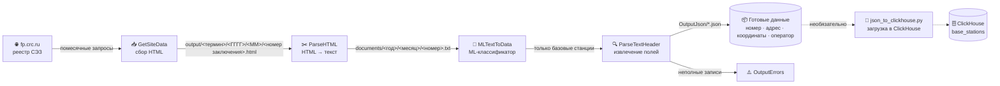
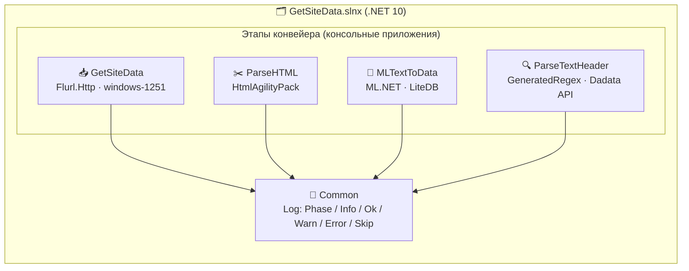
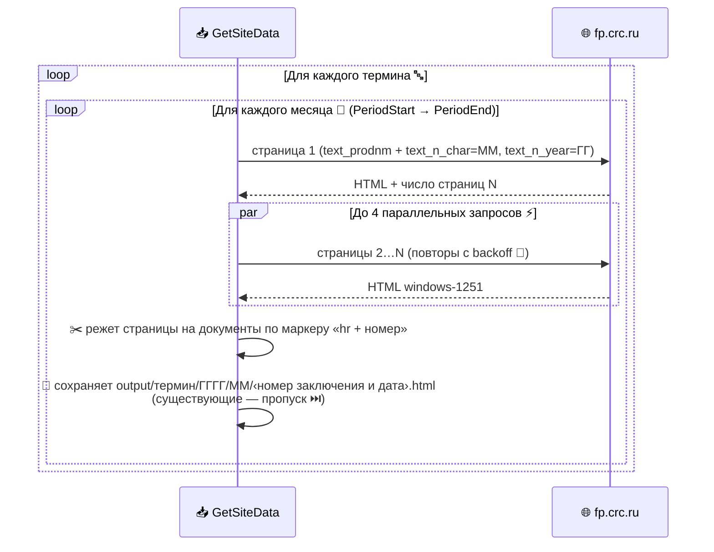
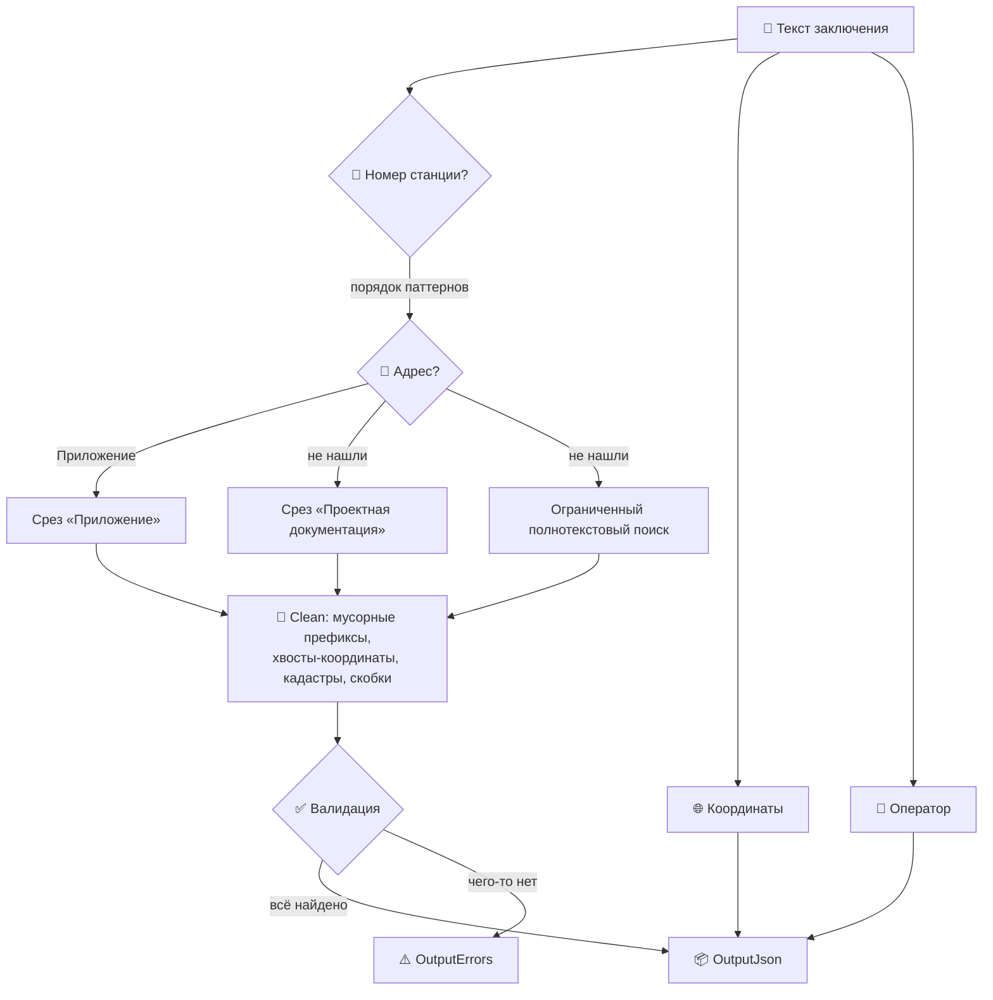
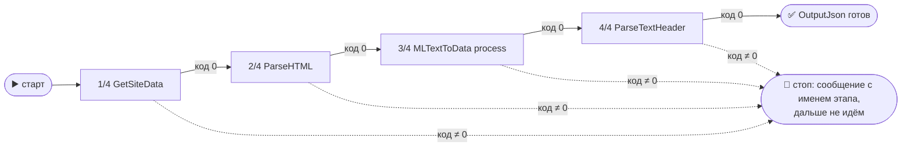

# 📡 Get data from fp.crc.ru

Конвейер сбора и разбора санитарно-эпидемиологических заключений (СЭЗ) о базовых станциях сотовой связи из открытого реестра [fp.crc.ru](https://fp.crc.ru/). На выходе — структурированные JSON: номер станции, адрес, координаты, оператор.

> 🎯 **Задача:** превратить сотни тысяч слабоструктурированных HTML-страниц реестра в чистый набор данных о размещении базовых станций по всей России.

---

## 🗺️ Общая схема конвейера



| Этап | Проект | Что делает |
|------|--------|-----------|
| 1️⃣ | **GetSiteData** | Помесячно скачивает результаты поиска по терминам и режет их на отдельные документы |
| 2️⃣ | **ParseHTML** | Разбирает HTML-фрагменты в плоские тексты заключений |
| 3️⃣ | **MLTextToData** | Бинарный ML-классификатор: отделяет базовые станции от посторонних СЭЗ (склады, производства…) |
| 4️⃣ | **ParseTextHeader** | Извлекает номер станции, адрес, координаты и оператора; опциональная нормализация адресов через Dadata |
| 5️⃣ | **json_to_clickhouse.py** 🐍 | *Необязательный этап:* пакетная загрузка готовых JSON в ClickHouse (многопоточно, с логированием) |
| 🧰 | **Common** | Общая библиотека логирования (единый стиль всех этапов) |

---

## 🏛️ Архитектура



Каждый этап — независимое консольное приложение. Все четыре лежат **в одном каталоге** и читают **общий `appsettings.json`**, где у каждого этапа своя секция. Данные передаются через файловую систему, поэтому этапы можно запускать по отдельности и перезапускать безопасно: **уже обработанные файлы пропускаются**.

### 📂 Каталог поставки

```
📁 Get-data-from-fp.crc.ru/          (в Linux — те же файлы без «.exe»)
├── GetSiteData.exe        1️⃣ сбор
├── ParseHTML.exe          2️⃣ разбор
├── MLTextToData.exe       3️⃣ классификация
├── ParseTextHeader.exe    4️⃣ извлечение
├── appsettings.json       ⚙️ общие настройки (секция на этап)
├── run-pipeline.cmd       ▶️ запуск всех этапов подряд (Windows)
├── run-pipeline.sh        ▶️ запуск всех этапов подряд (Linux)
├── json_to_clickhouse.py  5️⃣ загрузка JSON в ClickHouse (необязательно)
├── requirements.txt       🐍 зависимость скрипта (clickhouse-driver)
└── data/
    └── model.zip          🧠 обученная модель классификатора
```

Пути в настройках образуют сквозную цепочку — этапы стыкуются «из коробки»:

```
output/  →  documents/  →  cells/ + other/  →  OutputJson/ + OutputErrors/
```

Любой ключ переопределяется переменной окружения через `__`, например `ParseTextHeader__Dadata__Token=…` или `GetSiteData__Search__PeriodEnd=12.2026`.

---

## 📥 Этап 1: GetSiteData — сбор с сайта



Отдельного фильтра дат у сайта нет — помесячная выборка делается через октеты **месяца и года в номере заключения** (`…Т.002218.08.24` → `text_n_char=08`, `text_n_year=24`).

### ⚙️ Настройки — секция `GetSiteData` в общем `appsettings.json`

| Ключ | Пример | Назначение |
|------|--------|-----------|
| `Search:Terms` | `["базовая", "базовой", …]` | 🔤 Массив терминов поиска (включая типовые опечатки — документы с опечаткой находятся только по опечатке!) |
| `Search:PeriodStart` | `"01.2024"` | 📅 Начало сбора (ММ.ГГГГ) |
| `Search:PeriodEnd` | `"12.2024"` | 📅 Конец сбора включительно; равен началу — собираем один месяц |
| `OutputPath` | `"output"` | 📁 Корень выгрузки |
| `Processing:ResultsPerPage` | `50` | Результатов на страницу (rpp) |
| `Processing:Parallelism` | `4` | ⚡ Одновременных запросов (бережём чужой сайт) |
| `Processing:MaxAttempts` | `5` | 🔁 Повторы запроса с экспоненциальной задержкой |
| `Processing:RequestTimeoutSeconds` | `60` | ⏱️ Таймаут запроса |

📁 **Структура результата:**

```
output/
└── базовая/               ← термин поиска
    └── 2024/              ← год
        ├── 01/            ← месяц
        │   ├── 66.01.32.000.Т.005994.01.24 от 20.01.2024.html   ← номер заключения и дата
        │   └── 66.01.32.000.Т.005995.01.24 от 20.01.2024.html
        └── 02/
            └── …
```

---

## ✂️ Этап 2: ParseHTML — из HTML в текст

Разбирает сохранённые HTML (HtmlAgilityPack), склеивает текст заключения и пишет его в `documents/<год>/<месяц>/<номер заключения>.txt`. Имя берётся из поля «Номер заключения и дата», подкаталоги — из даты документа.

## 🧠 Этап 3: MLTextToData — классификация

Бинарный классификатор на **ML.NET**: отделяет документы о базовых станциях от посторонних СЭЗ. Разметка хранится в **LiteDB**, модель дообучается по мере пополнения выборки.

🧠 **Обученная модель `data/model.zip` входит в поставку** — работает сразу, обучать ничего не нужно. Она натренирована на 3292 размеченных заключениях: 2421 о базовых станциях и 871 постороннее (склады, котельные, АЗС, магазины, полигоны, очистные — скачаны с того же реестра по нейтральным терминам).

| Метрика на отложенных 20 % | Значение |
|---------------------------|----------|
| 🎯 Accuracy | **99,85 %** |
| 📈 AUC | 100 % |
| ⚖️ F1 | 99,89 % |
| 🔎 Precision / Recall | 99,79 % / 100 % |

Команды:

| Команда | Что делает |
|---------|-----------|
| `process` | 🧠 Классификация (при необходимости дообучает модель) |
| `train` | 🔁 Принудительное переобучение по размеченной выборке |
| `label <каталог> <cells\|other>` | 🏷️ Массовая разметка каталога для обучения |

Если модели нет, классификация автоматически переходит на эвристику ключевых слов — то же правило, что и в ParseTextHeader (отлажено на корпусе 111 917 документов).

## 🔍 Этап 4: ParseTextHeader — извлечение данных

Сердце конвейера: ~сотни прекомпилированных регулярных выражений (`[GeneratedRegex]`) вытаскивают из текста:

- 🔢 **Номер базовой станции** (десятки форматов: `66039`, `БС-13 Ноябрьская`, `86 ст. Москва-Пассажирская-Курская`, `БС АС7 КП107 КМ 334`…)
- 📍 **Адрес размещения** (трёхступенчатый поиск + умная чистка: обрезка технических хвостов, координат, кадастровых номеров; защита от обрезки легитимных уточнений «в 3100 м восточнее д. Безобразовка»)
- 🌐 **Координаты** (DMS и десятичные, все встречающиеся записи)
- 📶 **Оператор** (МТС, МегаФон, ВымпелКом, Т2, ЕКАТЕРИНБУРГ-2000 и др. + юрлица-владельцы)



Опционально адрес нормализуется через **Dadata** (ключи — в `appsettings.json`, переменных окружения `DADATA__TOKEN` / `DADATA__SECRET` или user-secrets; в репозитории ключей нет 🔒).

**Точность на корпусе 111 917 документов: 99,69 %** заполненных записей (0,31 % неполных — как правило, данные реально отсутствуют в первоисточнике).

## 🐍 Этап 5 (необязательный): json_to_clickhouse.py — выгрузка в ClickHouse

Пакетно заливает готовые JSON в таблицу ClickHouse: многопоточное чтение (рассчитан на сотни тысяч файлов), батчевая вставка, ротация логов и отдельный лог ошибок.

```powershell
pip install -r requirements.txt
python json_to_clickhouse.py --input-dir OutputJson --host localhost --database sanpin --table base_stations
```

🔒 Реквизиты подключения **в коде не хранятся** — задавайте их флагами или переменными окружения:

| Переменная | Назначение | По умолчанию |
|------------|-----------|--------------|
| `CH_HOST` / `CH_PORT` | 🖥️ Адрес и native-порт сервера | `localhost` / `9000` |
| `CH_DATABASE` / `CH_TABLE` | 🗄️ База и таблица | `sanpin` / `base_stations` |
| `CH_USER` / `CH_PASSWORD` | 🔑 Учётные данные | `default` / пусто |

---

## 🚀 Быстрый старт

### Вариант А: готовый релиз 📦

На странице [Releases](../../releases) — четыре архива: два варианта сборки под 🪟 Windows и 🐧 Linux.

| Сборка | Windows | Linux | Что внутри |
|--------|---------|-------|-----------|
| 🧳 **standalone** | `*-standalone-win-x64.zip` | `*-standalone-linux-x64.tar.gz` | Приложения со встроенным .NET + модель. **Ничего ставить не нужно** |
| 🪶 **compact** | `*-compact-win-x64.zip` | `*-compact-linux-x64.tar.gz` | Приложения + библиотеки + модель. Требуется [.NET 10 Runtime](https://dotnet.microsoft.com/download/dotnet/10.0) |

В любом архиве всё лежит **в одном каталоге**: распакуйте и запускайте по порядку.

<details open>
<summary>🪟 <b>Windows</b></summary>

```powershell
# 1. Настроить период и термины (секция GetSiteData)
notepad appsettings.json

# 2. Запустить весь конвейер одной командой
.\run-pipeline.cmd
```

▶️ `run-pipeline.cmd` последовательно вызывает все четыре этапа и **останавливается на первой же ошибке**, не запуская следующие. Можно и по одному:

```powershell
.\GetSiteData.exe          # 🌐 → output/
.\ParseHTML.exe            # 📄 → documents/
.\MLTextToData.exe process # 🧠 → cells/ + other/
.\ParseTextHeader.exe      # 📦 → OutputJson/ + OutputErrors/
```

```powershell
# 3. (необязательно) залить результат в ClickHouse
pip install -r requirements.txt
python json_to_clickhouse.py --input-dir OutputJson
```
</details>

<details open>
<summary>🐧 <b>Linux</b></summary>

```bash
tar xzf GetDataFpCrcRu-v1.1.0-standalone-linux-x64.tar.gz

# 1. Настроить период и термины (секция GetSiteData)
nano appsettings.json

# 2. Запустить весь конвейер одной командой
./run-pipeline.sh
```

▶️ `run-pipeline.sh` последовательно вызывает все четыре этапа и **останавливается на первой же ошибке**, не запуская следующие. Можно и по одному:

```bash
./GetSiteData             # 🌐 → output/
./ParseHTML               # 📄 → documents/
./MLTextToData process    # 🧠 → cells/ + other/
./ParseTextHeader         # 📦 → OutputJson/ + OutputErrors/
```

```bash
# 3. (необязательно) залить результат в ClickHouse
pip install -r requirements.txt
python3 json_to_clickhouse.py --input-dir OutputJson
```
</details>

### Вариант Б: сборка из исходников 🛠️

```bash
git clone https://github.com/akprof2000/Get-data-from-fp.crc.ru.git
cd Get-data-from-fp.crc.ru
dotnet build GetSiteData/GetSiteData.slnx -c Release
```

Собрать поставку в один каталог (замените `win-x64` на `linux-x64` для 🐧):

```bash
for p in GetSiteData ParseHTML MLTextToData ParseTextHeader; do
  dotnet publish GetSiteData/$p/$p.csproj -c Release -r win-x64 \
    --self-contained true -p:PublishSingleFile=true \
    -p:IncludeNativeLibrariesForSelfExtract=true -o publish
done
```

---

## 📖 Инструкция: настройки и скрипт запуска

### ⚙️ Полный `appsettings.json` с пояснениями

Один файл на весь конвейер, лежит рядом с приложениями. У каждого этапа — своя секция; JSON допускает комментарии.

```jsonc
{
  // ── Этап 1: сбор страниц с fp.crc.ru ────────────────────────────
  "GetSiteData": {
    "Search": {
      // Термины поиска. Опечатки не случайны: документы, где в самом
      // реестре опечатка, находятся ТОЛЬКО по опечатке.
      "Terms": [ "базавая", "базовая", "базовой", "базвой", "базово" ],
      // Период сбора включительно, формат ММ.ГГГГ.
      // Один месяц: одинаковые значения. Год: 01.2026 — 12.2026.
      "PeriodStart": "07.2026",
      "PeriodEnd": "07.2026"
    },
    "OutputPath": "output",          // куда складывать HTML
    "Processing": {
      "ResultsPerPage": 50,          // результатов на страницу выдачи
      "Parallelism": 4,              // одновременных запросов к сайту
      "MaxAttempts": 5,              // повторов при сбое запроса
      "RequestTimeoutSeconds": 60
    }
  },

  // ── Этап 2: HTML → тексты ───────────────────────────────────────
  "ParseHTML": {
    "InputPath": "output",           // вход = выход этапа 1
    "DocumentsPath": "documents"
  },

  // ── Этап 3: классификация ───────────────────────────────────────
  "MLTextToData": {
    "InputRoot": "documents",        // вход = выход этапа 2
    "CellsOutputRoot": "cells",      // сюда — базовые станции
    "NonCellsOutputRoot": "other",   // сюда — посторонние СЭЗ
    "DatabasePath": "data/state.db", // память «что уже обработано»
    "ModelPath": "data/model.zip",   // обученная модель (в поставке)
    "ParallelDegree": 8,
    "PredictionThreshold": 0.6       // порог уверенности модели
  },

  // ── Этап 4: извлечение данных ───────────────────────────────────
  "ParseTextHeader": {
    "InputBasePath": "cells",        // вход = выход этапа 3
    "OutputJsonPath": "OutputJson",
    "OutputErrorsPath": "OutputErrors",
    "Processing": { "LinesToRead": 12 },
    "Dadata": {                      // нормализация адресов (по желанию)
      "Enabled": false,
      "Token": "",                   // ключи сюда НЕ пишите — см. ниже
      "Secret": ""
    }
  }
}
```

💡 **Что менять на практике:** обычно только `Terms`, `PeriodStart`, `PeriodEnd`. Остальное настроено так, что этапы стыкуются автоматически — выход каждого является входом следующего.

🔑 **Секреты** (ключи Dadata) в файл не пишите — задайте переменными окружения:

```powershell
$env:ParseTextHeader__Dadata__Enabled = "true"
$env:ParseTextHeader__Dadata__Token   = "ваш-токен"
$env:ParseTextHeader__Dadata__Secret  = "ваш-секрет"
```

Так же переопределяется **любой** ключ файла: имя секции и вложенные ключи соединяются двойным подчёркиванием (`GetSiteData__Search__PeriodEnd=12.2026`).

### ▶️ Как работает `run-pipeline.cmd` / `run-pipeline.sh`

Скрипт — это просто последовательный запуск четырёх приложений из каталога поставки:



- 🛑 **Останавливается на первой ошибке** — если этап вернул ненулевой код, следующие не запускаются, а на экран выводится, какой этап упал и с каким кодом. Этот же код скрипт возвращает наружу (удобно для планировщика задач).
- 🔁 **Безопасно перезапускать.** Все этапы помнят, что уже сделано: сборщик пропускает скачанные документы, классификатор — обработанные (по базе `data/state.db` и по наличию файла), извлечение — уже разобранные. Упал сбор на середине — просто запустите скрипт ещё раз, он докачает недостающее и пройдёт дальше.
- 📅 **Дособрать новый месяц:** поменяйте `PeriodStart`/`PeriodEnd` в `appsettings.json` и снова запустите скрипт. Старые месяцы останутся на месте, скачается и обработается только новое.
- 🐍 **Пятый этап в цепочку не входит.** Выгрузка в ClickHouse запускается отдельно, когда JSON готовы: `python json_to_clickhouse.py --input-dir OutputJson`.

Типовой сценарий от нуля до данных:

```powershell
# 1) распаковать архив релиза в любую папку
# 2) указать период и термины
notepad appsettings.json
# 3) запустить и дождаться «Готово»
.\run-pipeline.cmd
# 4) результат — в OutputJson\<год>\<месяц>\*.json
```

⚠️ Если пользовались версией до v1.1.0: старые результаты лежали по другой раскладке (без год/месяц у классификатора, имена по номеру бланка у сборщика). Перед первым запуском новой версии очистите рабочие каталоги `output`, `documents`, `cells`, `other`, `OutputJson`, `OutputErrors` и `data/state.db` — иначе рядом со свежей структурой останутся старые дубли.

## 📜 Логи

Все этапы пишут единообразный лог через `Common.Log`:

```
[14:55:23] Старт парсера документов
[14:55:23] Входная директория : …/Documents
[14:55:24] [OK] базовая 202401: сохранено документов — 661
[14:55:25] [SKIP] Файл …/66.01.32.000.Т.005994.11.25 от 20.11.2025.html уже существует.
[14:55:31] [WARN] Документ №17 без номера заключения и номера бланка — пропущен.
```

---

## 🤝 Замечания

- 🐢 Параллелизм запросов к сайту намеренно ограничен — реестр публичный, не перегружаем.
- 🔁 Все этапы идемпотентны: повторный запуск докачивает/дообрабатывает только новое.
- 🧪 Изменения регулярных выражений проверяются регрессионно на полном корпусе (111 917 документов).
