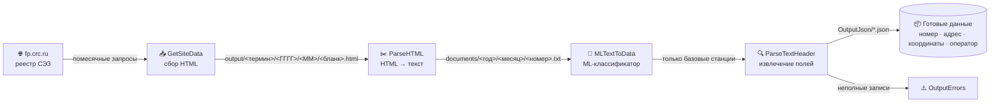
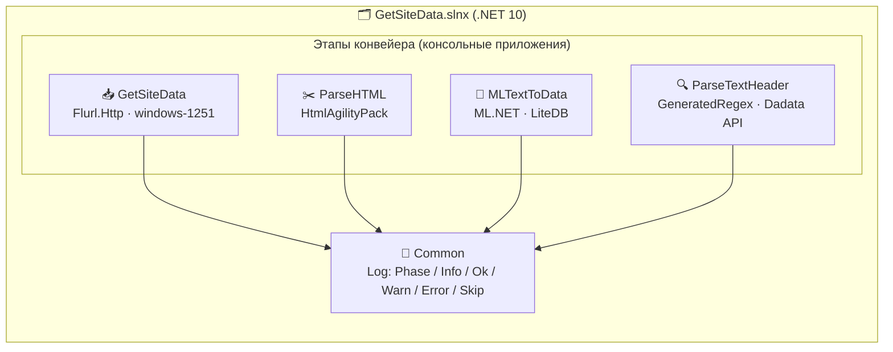
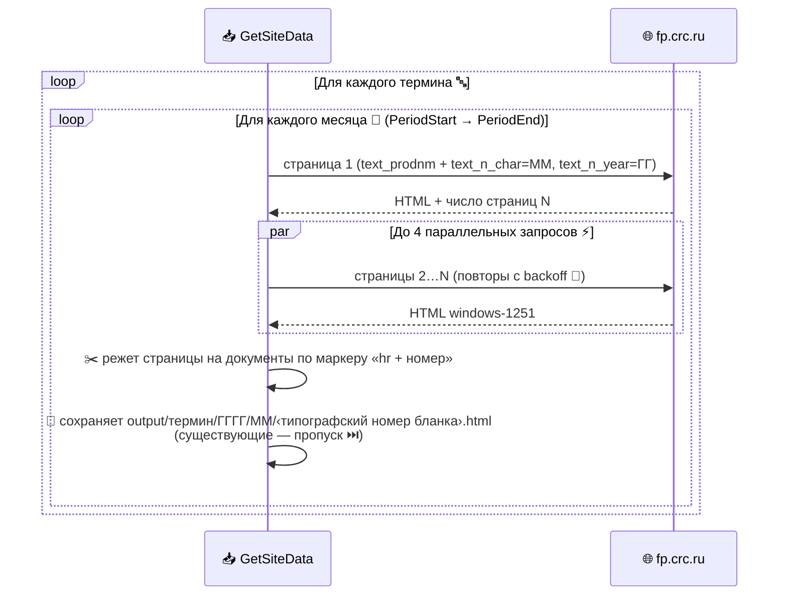
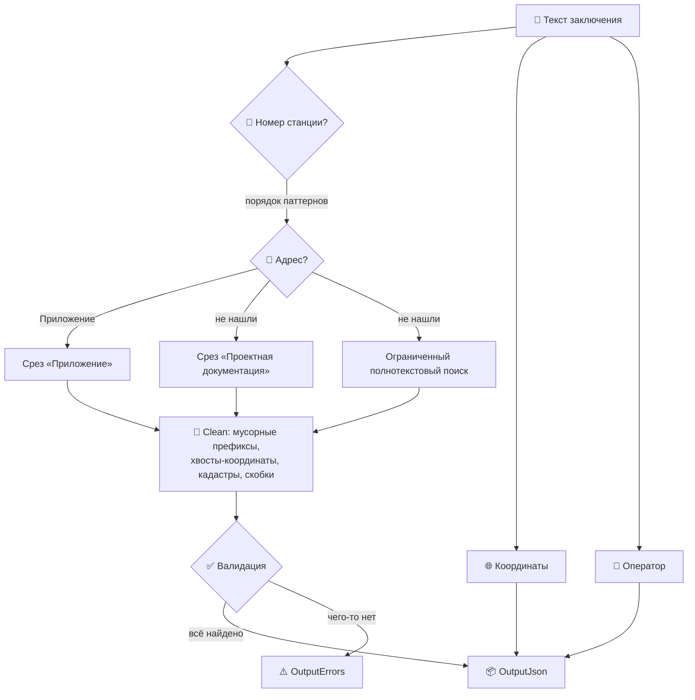

# 📡 Get data from fp.crc.ru

Конвейер сбора и разбора санитарно-эпидемиологических заключений (СЭЗ) о базовых станциях сотовой связи из открытого реестра [fp.crc.ru](https://fp.crc.ru/). На выходе — структурированные JSON: номер станции, адрес, координаты, оператор.

> 🎯 **Задача:** превратить сотни тысяч слабоструктурированных HTML-страниц реестра в чистый набор данных о размещении базовых станций по всей России.

---

## 🗺️ Общая схема конвейера



| Этап | Проект | Что делает |
|------|--------|-----------|
| 1️⃣ | **GetSiteData** | Помесячно скачивает результаты поиска по терминам и режет их на отдельные документы |
| 2️⃣ | **ParseHTML** | Разбирает HTML-фрагменты в плоские тексты заключений |
| 3️⃣ | **MLTextToData** | Бинарный ML-классификатор: отделяет базовые станции от посторонних СЭЗ (склады, производства…) |
| 4️⃣ | **ParseTextHeader** | Извлекает номер станции, адрес, координаты и оператора; опциональная нормализация адресов через Dadata |
| 🧰 | **Common** | Общая библиотека логирования (единый стиль всех этапов) |

---

## 🏛️ Архитектура



Каждый этап — независимое консольное приложение со своим `appsettings.json`. Данные передаются через файловую систему, поэтому этапы можно запускать по отдельности и перезапускать безопасно: **уже обработанные файлы пропускаются**.

---

## 📥 Этап 1: GetSiteData — сбор с сайта



Отдельного фильтра дат у сайта нет — помесячная выборка делается через октеты **месяца и года в номере заключения** (`…Т.002218.08.24` → `text_n_char=08`, `text_n_year=24`).

### ⚙️ Настройки (`GetSiteData/appsettings.json`)

| Ключ | Пример | Назначение |
|------|--------|-----------|
| `Search:Terms` | `["базовая", "базовой", …]` | 🔤 Массив терминов поиска (включая типовые опечатки — документы с опечаткой находятся только по опечатке!) |
| `Search:PeriodStart` | `"01.2024"` | 📅 Начало сбора (ММ.ГГГГ) |
| `Search:PeriodEnd` | `"12.2024"` | 📅 Конец сбора включительно; равен началу — собираем один месяц |
| `Paths:OutputPath` | `"output"` | 📁 Корень выгрузки |
| `Processing:ResultsPerPage` | `50` | Результатов на страницу (rpp) |
| `Processing:Parallelism` | `4` | ⚡ Одновременных запросов (бережём чужой сайт) |
| `Processing:MaxAttempts` | `5` | 🔁 Повторы запроса с экспоненциальной задержкой |
| `Processing:RequestTimeoutSeconds` | `60` | ⏱️ Таймаут запроса |

📁 **Структура результата:**

```
output/
└── базовая/               ← термин поиска
    └── 2024/              ← год
        ├── 01/            ← месяц
        │   ├── 2563309.html   ← типографский номер бланка
        │   └── 2563310.html
        └── 02/
            └── …
```

---

## ✂️ Этап 2: ParseHTML — из HTML в текст

Разбирает сохранённые HTML (HtmlAgilityPack), склеивает текст заключения и пишет его в `documents/<год>/<месяц>/<номер заключения>.txt`. Имя берётся из поля «Номер заключения и дата», подкаталоги — из даты документа.

## 🧠 Этап 3: MLTextToData — классификация

Бинарный классификатор на **ML.NET**: отделяет документы о базовых станциях от посторонних СЭЗ. Разметка хранится в **LiteDB**, модель дообучается по мере пополнения выборки.

Команды: `train` — принудительное переобучение; `process` — дообучение при необходимости + классификация.

## 🔍 Этап 4: ParseTextHeader — извлечение данных

Сердце конвейера: ~сотни прекомпилированных регулярных выражений (`[GeneratedRegex]`) вытаскивают из текста:

- 🔢 **Номер базовой станции** (десятки форматов: `66039`, `БС-13 Ноябрьская`, `86 ст. Москва-Пассажирская-Курская`, `БС АС7 КП107 КМ 334`…)
- 📍 **Адрес размещения** (трёхступенчатый поиск + умная чистка: обрезка технических хвостов, координат, кадастровых номеров; защита от обрезки легитимных уточнений «в 3100 м восточнее д. Безобразовка»)
- 🌐 **Координаты** (DMS и десятичные, все встречающиеся записи)
- 📶 **Оператор** (МТС, МегаФон, ВымпелКом, Т2, ЕКАТЕРИНБУРГ-2000 и др. + юрлица-владельцы)



Опционально адрес нормализуется через **Dadata** (ключи — в `appsettings.json`, переменных окружения `DADATA__TOKEN` / `DADATA__SECRET` или user-secrets; в репозитории ключей нет 🔒).

**Точность на корпусе 111 917 документов: 99,69 %** заполненных записей (0,31 % неполных — как правило, данные реально отсутствуют в первоисточнике).

---

## 🚀 Быстрый старт

### Вариант А: готовый релиз 📦

На странице [Releases](../../releases) два варианта:

| Сборка | Что внутри | Кому подходит |
|--------|-----------|---------------|
| 🧳 **standalone** (`*-standalone-win-x64.zip`) | Каждый этап — один exe со встроенным .NET. Ничего ставить не нужно | Запуск «как есть» на чистой машине |
| 🪶 **compact** (`*-compact-win-x64.zip`) | Маленькие exe + DLL-зависимости. Требуется установленный [.NET 10 Runtime](https://dotnet.microsoft.com/download/dotnet/10.0) | Минимальный размер |

```powershell
# 1. Настроить период и термины
notepad GetSiteData\appsettings.json

# 2. Запустить конвейер по этапам
GetSiteData\GetSiteData.exe
ParseHTML\ParseHTML.exe
MLTextToData\MLTextToData.exe process
ParseTextHeader\ParseTextHeader.exe
```

### Вариант Б: сборка из исходников 🛠️

```powershell
git clone https://github.com/akprof2000/Get-data-from-fp.crc.ru.git
cd Get-data-from-fp.crc.ru
dotnet build GetSiteData/GetSiteData.slnx -c Release
```

---

## 📜 Логи

Все этапы пишут единообразный лог через `Common.Log`:

```
[14:55:23] Старт парсера документов
[14:55:23] Входная директория : …/Documents
[14:55:24] [OK] базовая 202401: сохранено документов — 661
[14:55:25] [SKIP] Файл …/2563309.html уже существует.
[14:55:31] [WARN] Документ №17 без типографского номера бланка — пропущен.
```

---

## 🤝 Замечания

- 🐢 Параллелизм запросов к сайту намеренно ограничен — реестр публичный, не перегружаем.
- 🔁 Все этапы идемпотентны: повторный запуск докачивает/дообрабатывает только новое.
- 🧪 Изменения регулярных выражений проверяются регрессионно на полном корпусе (111 917 документов).
