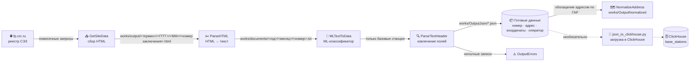
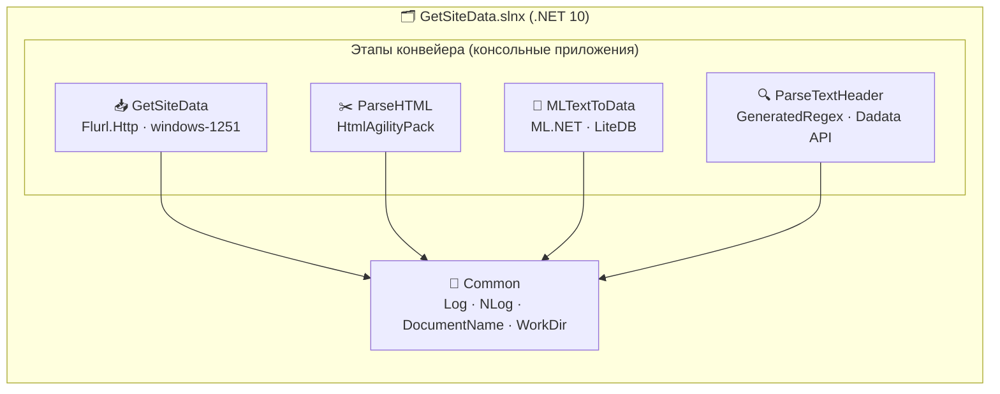
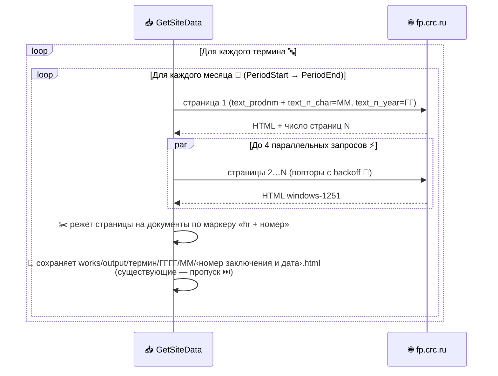
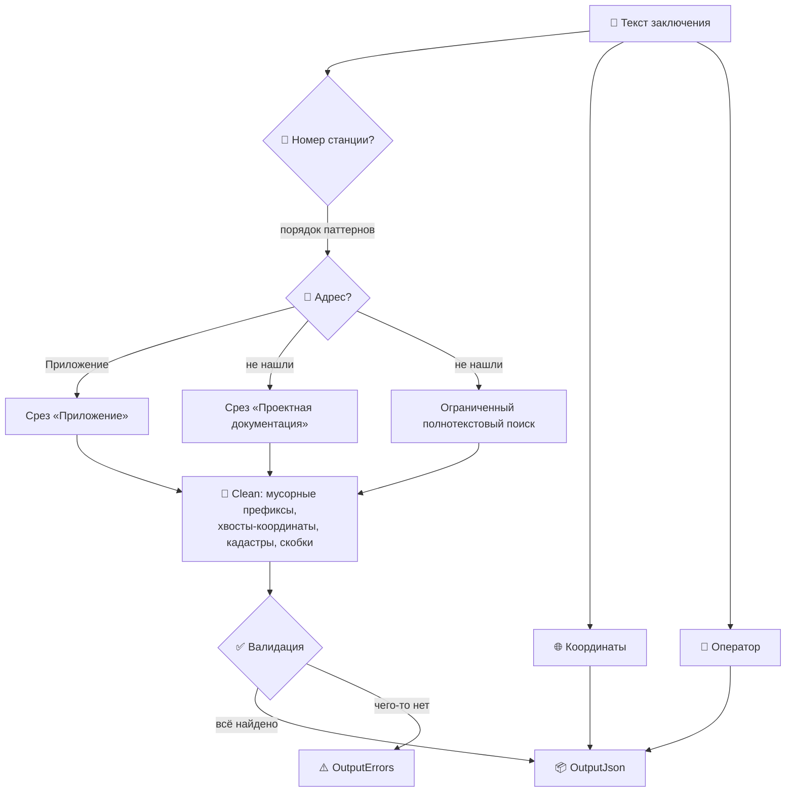
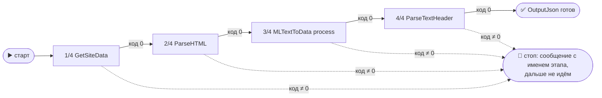

# 📡 Get data from fp.crc.ru

[](https://github.com/akprof2000/Get-data-from-fp.crc.ru/actions/workflows/release.yml)
[](https://github.com/akprof2000/Get-data-from-fp.crc.ru/releases/latest)
[](https://github.com/akprof2000/Get-data-from-fp.crc.ru/releases)
[](https://dotnet.microsoft.com/download/dotnet/10.0)
[](LICENSE)

Конвейер сбора и разбора санитарно-эпидемиологических заключений (СЭЗ) о базовых станциях сотовой связи из открытого реестра [fp.crc.ru](https://fp.crc.ru/). На выходе — структурированные JSON: номер станции, адрес, координаты, оператор.

> 🎯 **Задача:** превратить сотни тысяч слабоструктурированных HTML-страниц реестра в чистый набор данных о размещении базовых станций по всей России.

---

## 🗺️ Общая схема конвейера


```mermaid
flowchart LR
    A[🌐 fp.crc.ru<br>реестр СЭЗ] -->|помесячные запросы| B[📥 GetSiteData<br>сбор HTML]
    B -->|"works/output/&lt;термин&gt;/&lt;ГГГГ&gt;/&lt;ММ&gt;/&lt;номер заключения&gt;.html"| C[✂️ ParseHTML<br>HTML → текст]
    C -->|"works/documents/&lt;год&gt;/&lt;месяц&gt;/&lt;номер&gt;.txt"| D[🧠 MLTextToData<br>ML-классификатор]
    D -->|только базовые станции| E[🔍 ParseTextHeader<br>извлечение полей]
    E -->|"works/OutputJson/*.json"| F[(📦 Готовые данные<br>номер · адрес · координаты · оператор)]
    E -->|неполные записи| G[⚠️ OutputErrors]
    F -->|обогащение адресом по ГАР| N[🗺️ NormalizeAddress<br>works/OutputNormalized]
    F -.->|необязательно| H[🐍 json_to_clickhouse.py<br>загрузка в ClickHouse]
    H -.-> I[(🗄️ ClickHouse<br>base_stations)]
```

| Этап | Проект | Что делает |
|------|--------|-----------|
| 1️⃣&nbsp;| **GetSiteData** | Помесячно скачивает результаты поиска по терминам и режет их на отдельные документы |
| 2️⃣&nbsp;| **ParseHTML** | Разбирает HTML-фрагменты в плоские тексты заключений |
| 3️⃣&nbsp;| **MLTextToData** | Бинарный ML-классификатор: отделяет базовые станции от посторонних СЭЗ (склады, производства…) |
| 4️⃣&nbsp;| **ParseTextHeader** | Извлекает номер станции, адрес, координаты и оператора; опциональная нормализация адресов через Dadata |
| 5️⃣&nbsp;| **NormalizeAddress** | Нормализация адресов «под одну гребёнку» по офлайн-базе ГАР: адрес по частям + ФИАС-GUID + неадресные приметы места отдельным полем |
| 6️⃣&nbsp;| **json_to_clickhouse.py** 🐍&nbsp;| *Необязательный этап:* пакетная загрузка готовых JSON в ClickHouse (многопоточно, с логированием) |
| 🧰&nbsp;| **Common** | Общая библиотека: логирование (NLog), проверка формата имени документа, общий корень рабочих данных |
| 🗺️&nbsp;| **GetGarData** | *Вспомогательная утилита:* скачивание выгрузки ГАР (Госадресный реестр) с автообновлением по версии — для будущей офлайн-нормализации адресов |

---

## 🏛️ Архитектура


```mermaid
flowchart TB
    subgraph Solution["🗂️ GetSiteData.slnx (.NET 10)"]
        direction TB
        subgraph Stages["Этапы конвейера (консольные приложения)"]
            GSD[📥 GetSiteData<br>Flurl.Http · windows-1251]
            PH[✂️ ParseHTML<br>HtmlAgilityPack]
            ML[🧠 MLTextToData<br>ML.NET · LiteDB]
            PTH[🔍 ParseTextHeader<br>GeneratedRegex · Dadata API]
        end
        CMN[🧰 Common<br>Log · NLog · DocumentName · WorkDir]
        GSD --> CMN
        PH --> CMN
        ML --> CMN
        PTH --> CMN
    end
```

Каждый этап — независимое консольное приложение. Все четыре лежат **в одном каталоге** и читают **общий `appsettings.json`**, где у каждого этапа своя секция. Данные передаются через файловую систему, поэтому этапы можно запускать по отдельности и перезапускать безопасно: **уже обработанные файлы пропускаются**.

### 📂 Каталог поставки

```
📁 Get-data-from-fp.crc.ru/          (в Linux — те же файлы без «.exe»)
├── GetSiteData.exe        1️⃣ сбор
├── ParseHTML.exe          2️⃣ разбор
├── MLTextToData.exe       3️⃣ классификация
├── ParseTextHeader.exe    4️⃣ извлечение
├── appsettings.json       ⚙️ общие настройки (секция на этап)
├── run-pipeline.cmd       ▶️ запуск всех этапов подряд (Windows)
├── run-pipeline.sh        ▶️ запуск всех этапов подряд (Linux)
├── json_to_clickhouse.py  5️⃣ загрузка JSON в ClickHouse (необязательно)
├── requirements.txt       🐍 зависимость скрипта (clickhouse-driver)
├── data/
│   └── model.zip          🧠 обученная модель классификатора
├── works/                 📂 рабочие данные (создаётся при запуске)
└── logs/                  🪵 логи запусков (создаётся при запуске)
```

Пути в настройках образуют сквозную цепочку — этапы стыкуются «из коробки»:

```
works/output  →  works/documents  →  works/cells + works/other  →  works/OutputJson + works/OutputErrors
```

Любой ключ переопределяется переменной окружения через `__`, например `ParseTextHeader__Dadata__Token=…` или `GetSiteData__Search__PeriodEnd=12.2026`.

---

## 📥 Этап 1: GetSiteData — сбор с сайта


```mermaid
sequenceDiagram
    participant App as 📥 GetSiteData
    participant Site as 🌐 fp.crc.ru
    loop Для каждого термина 🔤
        loop Для каждого месяца 📅 (PeriodStart → PeriodEnd)
            App->>Site: страница 1 (text_prodnm + text_n_char=ММ, text_n_year=ГГ)
            Site-->>App: HTML + число страниц N
            par До 4 параллельных запросов ⚡
                App->>Site: страницы 2…N (повторы с backoff 🔁)
                Site-->>App: HTML windows-1251
            end
            App->>App: ✂️ режет страницы на документы по маркеру «hr + номер»
            App->>App: 💾 сохраняет works/output/термин/ГГГГ/ММ/‹номер заключения и дата›.html<br>(существующие — пропуск ⏭️)
        end
    end
```

Отдельного фильтра дат у сайта нет — помесячная выборка делается через октеты **месяца и года в номере заключения** (`…Т.002218.08.24` → `text_n_char=08`, `text_n_year=24`).

🔤 **Список терминов по умолчанию** (27 штук) построен замерами по реестру: объём каждого термина по всей истории (страниц выдачи × 50) плюс анализ пересечений на полном месяце (март 2025). Суммарно список даёт **+13,6 %** документов к поиску только по «базов»-формам; лишнее отсеивает ML-классификатор.

| Группа | Термин | ~Документов в реестре | Уникальный вклад* | Примечание |
|---|---|---:|---:|---|
| 🌟&nbsp;Словоформы | `базов*` | 719 800 | база | все падежи: базовая/базовой/базовые/базовых… |
| | `базав*`, `базв*` | 7 / 11 | ед. | опечатки из самого реестра |
| | `радиотелефон*` | 463 650 | +175 | «сети подвижной радиотелефонной связи» |
| | `сотов*` | 492 400 | +64 | крупнейший термин реестра |
| | `GSM*` | 431 750 | +18 | токены «GSM-900» и т.п. |
| | `LTE*` | 441 000 | вложен | точное «LTE» не находится вовсе — только wildcard |
| 📡&nbsp;Аббревиатуры | `ПРТО` | 191 000 | +41 | передающие радиотехнические объекты |
| | `РЭС` | 76 150 | +96 | самый шумный (~⅓ мусора) — чистит нейронка |
| | `BTS` | 64 800 | вложен | страховка для «БС № BTS-…» |
| 📶&nbsp;Операторы | `МТС` | 231 700 | +123 | серии «Проект модернизации БС №…» |
| | `Вымпел*` | 202 550 | +44 | ВымпелКом + Вымпел-Коммуникации |
| | `МегаФон` | 170 950 | ~+50 | счётчик «Найдено» на сайте врёт — вклад по выдаче |
| | `Мобайл` | 81 400 | вложен | Т2 Мобайл |
| | `ЕКАТЕРИНБУРГ*` | 37 750 | — | оператор «Мотив» |
| | `Ростелеком*` | 20 100 | — | БС в малых сёлах (программа УЦН) |
| | `К-телеком*` / `K-телеком*` | 16 550 / 23 850 | — | кириллическая и латинская «К» — разные слова! |
| | `Теле2` | 12 300 | — | |
| | `Билайн` | 7 850 | — | |
| | `Скартел*` | 6 200 | — | юрлицо Yota |
| 🔀&nbsp;Двойной алфавит | `Cкартел*` (лат. C) | 350 | — | перепутанные буквы встречаются в реестре |
| | `МТC` (лат. C) | 200 | — | |
| | `Tele2*` | 150 | — | |
| | `BТS` (кир. Т) | 100 | — | |
| | `MTC` / `MTS` (лат.) | 45 / 39 | — | |

\* уникальный вклад — новые документы за март 2025 при последовательном добавлении терминов к базе «базов»-форм (4330 документов за месяц); «вложен» — термин не даёт уникальных документов, но оставлен как страховка на другие месяцы; «—» — не входил в помесячный замер, объём мал.

Отвергнуты по замерам: «подвижной» (полностью вложен в `радиотелефон*`), «ГСМ» (склады топлива), «ВТС» (ООО «ВТС», ангары), «Вымпел» без звёздочки (заводы-однофамильцы), «ВымпелКом»/«приемопередающая»/«радиоподсистема» (вложены).

### ⚙️ Настройки — секция `GetSiteData` в общем `appsettings.json`

| Ключ | Пример | Назначение |
|------|--------|-----------|
| `Search:Terms` | `["базов*", "сотов*", "МТС", …]` | 🔤&nbsp;Массив терминов поиска. Поддерживаются wildcard («базов*» — все словоформы). Список по умолчанию покрывает формулировки, операторов и варианты с перепутанным алфавитом (МТС/MTC) |
| `Search:PeriodStart` | `"01.2024"` | 📅&nbsp;Начало сбора (ММ.ГГГГ) |
| `Search:PeriodEnd` | `"12.2024"` | 📅&nbsp;Конец сбора включительно; равен началу — собираем один месяц |
| `OutputPath` | `"output"` | 📁&nbsp;Корень выгрузки; относительный путь собирается под общим `WorkRoot` → `works/output` |
| `Processing:ResultsPerPage` | `50` | Результатов на страницу (rpp) |
| `Processing:Parallelism` | `4` | ⚡&nbsp;Одновременных запросов (бережём чужой сайт) |
| `Processing:MaxAttempts` | `5` | 🔁&nbsp;Повторы запроса с экспоненциальной задержкой |
| `Processing:RequestTimeoutSeconds` | `60` | ⏱️&nbsp;Таймаут запроса |

📁 **Структура результата:**

```
works/output/
└── базов_/                ← термин поиска («базов*», спецсимволы → «_»)
    └── 2024/              ← год
        ├── 01/            ← месяц
        │   ├── 66.01.32.000.Т.005994.01.24 от 20.01.2024.html   ← номер заключения и дата
        │   └── 66.01.32.000.Т.005995.01.24 от 20.01.2024.html
        └── 02/
            └── …
```

---

## ✂️ Этап 2: ParseHTML — из HTML в текст

Разбирает сохранённые HTML (HtmlAgilityPack), склеивает текст заключения и пишет его в `works/documents/<год>/<месяц>/<номер заключения>.txt`. Имя берётся из поля «Номер заключения и дата», подкаталоги — из даты документа.

## 🧠 Этап 3: MLTextToData — классификация

Бинарный классификатор на **ML.NET**: отделяет документы о базовых станциях от посторонних СЭЗ. Разметка хранится в **LiteDB**, модель дообучается по мере пополнения выборки.

🧠 **Обученная модель `data/model.zip` входит в поставку** — работает сразу, обучать ничего не нужно. Она натренирована на 3292 размеченных заключениях: 2421 о базовых станциях и 871 постороннее (склады, котельные, АЗС, магазины, полигоны, очистные — скачаны с того же реестра по нейтральным терминам).

| Метрика на отложенных 20 % | Значение |
|---------------------------|----------|
| 🎯&nbsp;Accuracy | **99,85 %** |
| 📈&nbsp;AUC | 100 % |
| ⚖️&nbsp;F1 | 99,89 % |
| 🔎&nbsp;Precision / Recall | 99,79 % / 100 % |

Команды:

| Команда | Что делает |
|---------|-----------|
| `process` | 🧠&nbsp;Классификация (при необходимости дообучает модель) |
| `train` | 🔁&nbsp;Принудительное переобучение по размеченной выборке |
| `label <каталог> <cells\|other>` | 🏷️&nbsp;Массовая разметка каталога для обучения |

Если модели нет, классификация автоматически переходит на эвристику ключевых слов. Классификатор — единственный фильтр конвейера: ParseTextHeader разбирает всё, что получил, без собственных проверок.

## 🔍 Этап 4: ParseTextHeader — извлечение данных

Сердце конвейера: ~сотни прекомпилированных регулярных выражений (`[GeneratedRegex]`) вытаскивают из текста:

- 🔢 **Номер базовой станции** (десятки форматов: `66039`, `БС-13 Ноябрьская`, `86 ст. Москва-Пассажирская-Курская`, `БС АС7 КП107 КМ 334`…)
- 📍 **Адрес размещения** (трёхступенчатый поиск + умная чистка: обрезка технических хвостов, координат, кадастровых номеров; защита от обрезки легитимных уточнений «в 3100 м восточнее д. Безобразовка»)
- 🌐 **Координаты** (DMS и десятичные, все встречающиеся записи)
- 📶 **Оператор** (МТС, МегаФон, ВымпелКом, Т2, ЕКАТЕРИНБУРГ-2000 и др. + юрлица-владельцы)
- 📏 **Высоты подвеса антенн** (`antennaHeights`) — массив объектов `{height, base, antenna, antennaNumber}`: высота в метрах; база отсчёта из документа («земля»/«кровля», парная форма «над уровнем земли/кровли: 39,48/-» раскладывается по базам); тип/модель антенны и её номер, когда они названы в той же записи («тип антенны - A1- ODV-065…», «№1 Коллинеарная антенна; …»). Формы записи: «высота подвеса …: 24, 27 м», «…, м: 50; 49,5», табличные «…, м 27.50»; списки через `,`/`;`/`/`, диапазоны «19-23 м». Неизвестные поля опускаются; поле необязательное, в критерий полноты не входит. Покрытие: ~24 % корпуса


```mermaid
flowchart TB
    T[📄 Текст заключения] --> N{🔢 Номер станции?}
    N -->|порядок паттернов| A{📍 Адрес?}
    A -->|Приложение| A1[Срез «Приложение»]
    A -->|не нашли| A2[Срез «Проектная документация»]
    A -->|не нашли| A3[Ограниченный полнотекстовый поиск]
    A1 & A2 & A3 --> CL[🧹 Clean: мусорные префиксы,<br>хвосты-координаты, кадастры, скобки]
    CL --> V{✅ Валидация}
    V -->|всё найдено| OK[📦 OutputJson]
    V -->|чего-то нет| ERR[⚠️ OutputErrors]
    T --> C[🌐 Координаты] --> OK
    T --> O[📶 Оператор] --> OK
```

Опционально адрес нормализуется через **Dadata** (ключи — в `appsettings.json`, переменных окружения `ParseTextHeader__Dadata__Token` / `…__Secret` или user-secrets; в репозитории ключей нет 🔒).

♻️ **Перепрогон ошибок после обновления парсера.** Конвейер помечает документ обработанным даже при неполном результате, поэтому улучшения паттернов сами по себе не доходят до старых ошибок. Ключ `Processing:ReprocessErrors = true` (или `ParseTextHeader__Processing__ReprocessErrors=true`) заставляет заново разобрать все файлы, чей результат лежит в `OutputErrors`: успешно разобранные переезжают в `OutputJson`, их JSON-ошибки удаляются, остальные перезаписываются результатом текущей версии. Включайте разово после обновления, для обычных инкрементальных прогонов держите `false`.

**Точность на корпусе 151 703 документов: 96,6 %** полных записей (146 484 полных, 5 219 неполных — как правило, номер станции или оператор реально отсутствуют в первоисточнике: ведомственные радиосети, авиационные ОПРС, спутниковые КРЛ). Координаты извлекаются у ~88,5 % полных записей (125 061 из 141 263); поле необязательное — у остальных их, как правило, нет в тексте вовсе.

## 🗺️ Этап 5: NormalizeAddress — нормализация адресов по ГАР

Приводит адреса «под одну гребёнку» по офлайн-базе Государственного адресного реестра (ГАР, бывший ФИАС). Каждый JSON из `OutputJson` копируется в `OutputNormalized` с добавленным объектом `address`:

```json
"address": {
  "region": "Республика Адыгея",        // части адреса — только реально найденные
  "district": "Теучежский р-н",         // (null-поля не пишутся вовсе)
  "settlement": "аул Понежукай",        // тип канонизируется по ГАР: «с.» → «аул»
  "street": "ул. Чкалова",
  "building": "6, корп. 2",             // дом сквозным текстом: дроби, корпуса, литеры
  "extra": "ОДН АО \"НБК\"",            // НЕадресные приметы места: опоры, столбы, расстояния
  "matchLevel": "street",               // до какого уровня ГАР дошло сопоставление
  "guid": "574d049a-…",                 // ФИАС-GUID самого глубокого уровня
  "regionCode": 1,
  "lat": null, "lon": null              // зарезервировано под геокодер (в ГАР координат НЕТ)
}
```

### Команды

| Команда | Что делает |
|---|---|
| `import` | Полная конвертация выгрузки `gar_xml.zip` → SQLite (`works/gar/gar.sqlite`, ~250 МБ). Источник (`GarSource`) — локальный файл ИЛИ URL: по URL архив читается HTTP Range-запросами, и из 53 ГБ скачиваются только нужные ~3 ГБ (адресные объекты + иерархия, без домов) |
| `update` | 🤖 **Сам отслеживает необходимость обновления**: сравнивает версию базы с сервисом ФНС и выбирает путь — «актуально» / применить дельты (мегабайты) / полная пересборка (базы нет или отставание > 45 версий). Идемпотентен, годится для планировщика |
| `normalize` | Обогащение JSON объектом `address`. Базы нет — сам пытается собрать её (через `update` или из локального файла); собрать неоткуда — этап пропускается без ошибки |
| `import-osm [файл\|URL]` | Импорт OSM-выгрузки (`*.osm.pbf`) в геотаблицы базы: населённые пункты и именованные улицы с координатами. Источник — аргумент или ключ `OsmSource`; скачанный файл после укладки удаляется |
| `set-version <id>` | Записать номер версии ГАР в базу (после ручного `import` из файла) |
| `sql "<SELECT>"` | Диагностика: запрос к базе |

### Как сопоставляются адреса

Иерархический спуск: регион → район/МО → город/НП → планировочная структура → улица. Поиск регистро- и словопорядко-независимый («ул. 3-я линия» = «Линия 3-я ул.»), опечатки лечит Дамерау-Левенштейн с допуском ~80 % сходства (перестановка соседних букв — одна правка). Понимает: аббревиатуры регионов (УР, КБР, ХМАО…), города федерального значения, адреса без региона (восстанавливается по уникальному имени района или города), «г.о. город Казань», разорванные запятой дроби расстояний («0,09 км юго-западнее»). Дом в ГАР не ищется — переносится текстом со всеми корпусами/строениями/литерами. Улицы в ГАР нет — она уходит в `extra`, а `matchLevel` честно говорит, до чего дошли.

### ⚙️ Настройки — секция `NormalizeAddress`

| Ключ | По умолчанию | Назначение |
|---|---|---|
| `GarSource` | URL выгрузки | Путь к `gar_xml.zip` или https-URL |
| `DbPath` | `data/gar.sqlite` рядом с приложением | SQLite-база. По умолчанию живёт в `data/` — как модель классификатора: это долгоживущий справочник, чистка `works` его не трогает. Явно заданный относительный путь — под `WorkRoot` |
| `IncludeHouses` | `false` | 🏠 Режим «до дома»: полная адресная книга (+40 млн записей, скачивание ~30 ГБ вместо ~3, база — гигабайты). **Эта же галочка включает заполнение `address.lat/lon`**; выключена — координаты адресов не заполняются вовсе |
| `OsmSource` | URL Geofabrik | OSM-выгрузка `*.osm.pbf` для геокодера: файл или URL (полная Россия ~4 ГБ; для проверки годится региональный срез, напр. `crimean-fed-district-latest`) |
| `OsmMaxAgeDays` | `90` | Автообновление OSM-геоданных командой `update`: старше стольких дней — переимпорт из `OsmSource` |
| `InputJsonPath` | `OutputJson` | Откуда читать JSON |
| `OutputNormalizedPath` | `OutputNormalized` | Куда писать обогащённые |

### 📍 Как получить адрес с координатами

В обогащённом JSON (`works/OutputNormalized/*.json`) есть всё сразу:

- **`coordinates`** (корневое поле) — координаты станции **из текста документа**: это точка размещения самой станции, самый точный источник («55.634, 38.0443»);
- **`address`** — канонический адрес по частям из ГАР + `guid` + `regionCode`; неадресные приметы места («столб в 10 м направо…») — в `address.extra`;
- **`address.lat` / `address.lon`** — координаты найденного адресного объекта из офлайн-геокодера ГАР+OSM. ⚠️ В самом ГАР координат нет ни в какой комплектации — источник координат: OSM-выгрузка (`import-osm`). Заполняются **только в режиме `IncludeHouses: true`** («ГАР до дома» — эта же галочка включает геокодирование); в облегчённом режиме координаты адресов не заполняются вовсе. Геокодер работает строго по локальной базе: никаких сетевых запросов, тёзки разрешаются по близости к координатам станции из документа, не нашлась координата — поле остаётся пустым и конвейер не задерживается.

Практическое правило потребителю данных: **для точки станции берите `coordinates`**, а `address.lat/lon` — фоллбэк для записей, где в документе координат не было, и опора для проверок «адрес соответствует координатам».

### 🏠 Переключение режима «с домами / без домов»

Режим меняется одним ключом `IncludeHouses` — базу вручную пересобирать не нужно, `update`/`normalize` согласуют её сами:

- **выключили дома** → дома и их связи удаляются из существующей базы (быстро, адресные объекты не трогаются);
- **включили дома** → ДОскачиваются только дома и их связи (адресные объекты и иерархия НП/улиц не перекачиваются).

Скачанные файлы после укладки в базу удаляются автоматически: дельты качаются в память и на диск не пишутся вовсе, локальный архив выгрузки после `import` стирается (ключ `DeleteSourceAfterImport: false` — оставить, например если файл ещё нужен для последующего включения домов).

**Закрытый контур:** выгрузку скачивает утилита GetGarData на машине с интернетом, архив заносится файлом, `GarSource` указывается на него; `import` + `set-version` — и дальше `normalize` работает полностью офлайн.

## 🗺️ Вспомогательная утилита: GetGarData — выгрузка ГАР с автообновлением

Готовит данные для будущего этапа офлайн-нормализации адресов «под одну гребёнку». Запускается на машине **с доступом в интернет**; скачанный архив переносится в закрытый контур.

- Спрашивает у официального сервиса ФНС ([GetLastDownloadFileInfo](https://fias.nalog.ru/WebServices/Public/GetLastDownloadFileInfo)) номер актуальной версии и прямую ссылку на `gar_xml.zip`.
- Сравнивает с локальным состоянием (`gar/version.json`): версия не новее — выход без скачивания, поэтому утилиту можно запускать по расписанию хоть ежедневно.
- Качает во временный `*.part` с докачкой после обрыва (HTTP Range) и повторами с backoff; по завершении сверяет размер и атомарно переименовывает в `gar_xml_<версия>_full.zip`.
- Аргумент `check` — только проверить наличие обновления. Ключ `GetGarData:Delta = true` — качать дельту вместо полной выгрузки.

## 🐍 Этап 5 (необязательный): json_to_clickhouse.py — выгрузка в ClickHouse

Пакетно заливает готовые JSON в таблицу ClickHouse: многопоточное чтение (рассчитан на сотни тысяч файлов), батчевая вставка, ротация логов и отдельный лог ошибок.

```powershell
pip install -r requirements.txt
python json_to_clickhouse.py --input-dir works/OutputJson --host localhost --database sanpin --table base_stations
```

🔒 Реквизиты подключения **в коде не хранятся** — задавайте их флагами или переменными окружения:

| Переменная | Назначение | По умолчанию |
|------------|-----------|--------------|
| `CH_HOST` / `CH_PORT` | 🖥️&nbsp;Адрес и native-порт сервера | `localhost` / `9000` |
| `CH_DATABASE` / `CH_TABLE` | 🗄️&nbsp;База и таблица | `sanpin` / `base_stations` |
| `CH_USER` / `CH_PASSWORD` | 🔑&nbsp;Учётные данные | `default` / пусто |

---

## 🚀 Быстрый старт

### Вариант А: готовый релиз 📦

На странице [Releases](../../releases) — четыре архива: два варианта сборки под 🪟 Windows и 🐧 Linux.

| Сборка | Windows | Linux | Что внутри |
|--------|---------|-------|-----------|
| 🧳&nbsp;**standalone** | `*-standalone-win-x64.zip` | `*-standalone-linux-x64.tar.gz` | Приложения со встроенным .NET + модель. **Ничего ставить не нужно** |
| 🪶&nbsp;**compact** | `*-compact-win-x64.zip` | `*-compact-linux-x64.tar.gz` | Приложения + библиотеки + модель. Требуется [.NET 10 Runtime](https://dotnet.microsoft.com/download/dotnet/10.0) |

В любом архиве всё лежит **в одном каталоге**: распакуйте и запускайте по порядку.

<details open>
<summary>🪟 <b>Windows</b></summary>

```powershell
# 1. Настроить период и термины (секция GetSiteData)
notepad appsettings.json

# 2. Запустить весь конвейер одной командой
.\run-pipeline.cmd
```

▶️ `run-pipeline.cmd` последовательно вызывает все четыре этапа и **останавливается на первой же ошибке**, не запуская следующие. Можно и по одному:

```powershell
.\GetSiteData.exe          # 🌐 → works/output/
.\ParseHTML.exe            # 📄 → works/documents/
.\MLTextToData.exe process # 🧠 → works/cells/ + works/other/
.\ParseTextHeader.exe      # 📦 → works/OutputJson/ + works/OutputErrors/
```

```powershell
# 3. (необязательно) залить результат в ClickHouse
pip install -r requirements.txt
python json_to_clickhouse.py --input-dir works/OutputJson
```
</details>

<details open>
<summary>🐧 <b>Linux</b></summary>

```bash
tar xzf GetDataFpCrcRu-v1.5.0-standalone-linux-x64.tar.gz

# 1. Настроить период и термины (секция GetSiteData)
nano appsettings.json

# 2. Запустить весь конвейер одной командой
./run-pipeline.sh
```

▶️ `run-pipeline.sh` последовательно вызывает все четыре этапа и **останавливается на первой же ошибке**, не запуская следующие. Можно и по одному:

```bash
./GetSiteData             # 🌐 → works/output/
./ParseHTML               # 📄 → works/documents/
./MLTextToData process    # 🧠 → works/cells/ + works/other/
./ParseTextHeader         # 📦 → works/OutputJson/ + works/OutputErrors/
```

```bash
# 3. (необязательно) залить результат в ClickHouse
pip install -r requirements.txt
python3 json_to_clickhouse.py --input-dir works/OutputJson
```
</details>

### Вариант Б: сборка из исходников 🛠️

```bash
git clone https://github.com/akprof2000/Get-data-from-fp.crc.ru.git
cd Get-data-from-fp.crc.ru
dotnet build GetSiteData/GetSiteData.slnx -c Release
```

Собрать поставку в один каталог (замените `win-x64` на `linux-x64` для 🐧):

```bash
for p in GetSiteData ParseHTML MLTextToData ParseTextHeader; do
  dotnet publish GetSiteData/$p/$p.csproj -c Release -r win-x64 \
    --self-contained true -p:PublishSingleFile=true \
    -p:IncludeNativeLibrariesForSelfExtract=true -o publish
done
```

---

## 📖 Инструкция: настройки и скрипт запуска

### ⚙️ Полный `appsettings.json` с пояснениями

Один файл на весь конвейер, лежит рядом с приложениями. У каждого этапа — своя секция; JSON допускает комментарии.

```jsonc
{
  // ── Общий корень рабочих данных ─────────────────────────────────
  // Все относительные пути этапов собираются под ним: works/output,
  // works/documents… Абсолютный путь в настройке этапа игнорирует WorkRoot.
  "WorkRoot": "works",

  // ── Логирование (NLog) ──────────────────────────────────────────
  // Цветная консоль + файл logs/<приложение>.log: ротация по 20 МБ,
  // не более 10 архивных частей, очистка папки логов при старте.
  // Полная секция — в appsettings.json поставки; менять обычно не нужно.
  "NLog": { "…": "…" },

  // ── Этап 1: сбор страниц с fp.crc.ru ────────────────────────────
  "GetSiteData": {
    "Search": {
      // Термины поиска: словоформы через wildcard «*», операторы и
      // варианты с перепутанным алфавитом (МТС/МТC/MTC). Полный
      // рабочий список — в appsettings.json поставки.
      "Terms": [ "базов*", "радиотелефон*", "сотов*", "GSM*", "МТС", "…" ],
      // Период сбора включительно, формат ММ.ГГГГ.
      // Один месяц: одинаковые значения. Год: 01.2026 — 12.2026.
      "PeriodStart": "07.2026",
      "PeriodEnd": "07.2026"
    },
    "OutputPath": "output",          // → works/output (под WorkRoot)
    "Processing": {
      "ResultsPerPage": 50,          // результатов на страницу выдачи
      "Parallelism": 4,              // одновременных запросов к сайту
      "MaxAttempts": 5,              // повторов при сбое запроса
      "RequestTimeoutSeconds": 60
    }
  },

  // ── Этап 2: HTML → тексты ───────────────────────────────────────
  "ParseHTML": {
    "InputPath": "output",           // вход = выход этапа 1 (works/output)
    "DocumentsPath": "documents"
  },

  // ── Этап 3: классификация ───────────────────────────────────────
  "MLTextToData": {
    "InputRoot": "documents",        // вход = выход этапа 2 (works/documents)
    "CellsOutputRoot": "cells",      // сюда — базовые станции
    "NonCellsOutputRoot": "other",   // сюда — посторонние СЭЗ
    "DatabasePath": "data/state.db", // память «что уже обработано» (works/data)
    "ModelPath": "data/model.zip",   // модель из поставки (рядом с exe, БЕЗ WorkRoot)
    "ParallelDegree": 8,
    "PredictionThreshold": 0.6       // порог уверенности модели
  },

  // ── Этап 4: извлечение данных ───────────────────────────────────
  "ParseTextHeader": {
    "InputBasePath": "cells",        // вход = выход этапа 3 (works/cells)
    "OutputJsonPath": "OutputJson",
    "OutputErrorsPath": "OutputErrors",
    "Processing": { "LinesToRead": 12 },
    "Dadata": {                      // нормализация адресов (по желанию)
      "Enabled": false,
      "Token": "",                   // ключи сюда НЕ пишите — см. ниже
      "Secret": ""
    }
  }
}
```

💡 **Что менять на практике:** обычно только `Terms`, `PeriodStart`, `PeriodEnd`. Остальное настроено так, что этапы стыкуются автоматически — выход каждого является входом следующего.

🔑 **Секреты** (ключи Dadata) в файл не пишите — задайте переменными окружения:

```powershell
$env:ParseTextHeader__Dadata__Enabled = "true"
$env:ParseTextHeader__Dadata__Token   = "ваш-токен"
$env:ParseTextHeader__Dadata__Secret  = "ваш-секрет"
```

Так же переопределяется **любой** ключ файла: имя секции и вложенные ключи соединяются двойным подчёркиванием (`GetSiteData__Search__PeriodEnd=12.2026`).

### ▶️ Как работает `run-pipeline.cmd` / `run-pipeline.sh`

Скрипт — это просто последовательный запуск четырёх приложений из каталога поставки:


```mermaid
flowchart LR
    S([▶️ старт]) --> A[1/4 GetSiteData]
    A -->|код 0| B[2/4 ParseHTML]
    B -->|код 0| C[3/4 MLTextToData process]
    C -->|код 0| D[4/4 ParseTextHeader]
    D -->|код 0| OK([✅ OutputJson готов])
    A & B & C & D -.->|код ≠ 0| ERR([🛑 стоп: сообщение с именем этапа,<br>дальше не идём])
```

- 🛑 **Останавливается на первой ошибке** — если этап вернул ненулевой код, следующие не запускаются, а на экран выводится, какой этап упал и с каким кодом. Этот же код скрипт возвращает наружу (удобно для планировщика задач).
- 🔁 **Безопасно перезапускать.** Все этапы помнят, что уже сделано: сборщик пропускает скачанные документы, классификатор — обработанные (по базе `works/data/state.db` и по наличию файла), извлечение — уже разобранные. Упал сбор на середине — просто запустите скрипт ещё раз, он докачает недостающее и пройдёт дальше.
- 📅 **Дособрать новый месяц:** поменяйте `PeriodStart`/`PeriodEnd` в `appsettings.json` и снова запустите скрипт. Старые месяцы останутся на месте, скачается и обработается только новое.
- 🐍 **Пятый этап в цепочку не входит.** Выгрузка в ClickHouse запускается отдельно, когда JSON готовы: `python json_to_clickhouse.py --input-dir works/OutputJson`.

Типовой сценарий от нуля до данных:

```powershell
# 1) распаковать архив релиза в любую папку
# 2) указать период и термины
notepad appsettings.json
# 3) запустить и дождаться «Готово»
.\run-pipeline.cmd
# 4) результат — в works\OutputJson\<год>\<месяц>\*.json
```

⚠️ Если пользовались версией до v1.2.0: рабочие данные лежали в корне поставки (`output/`, `documents/`, …), а не под `works/`, и раскладка была другой. Перед первым запуском новой версии перенесите старые каталоги внутрь `works/` или удалите их — иначе конвейер начнёт сбор заново, а рядом останутся дубли.

## 🪵 Логи

Логирование — через **NLog**, настройка в секции `NLog` общего `appsettings.json`. Каждый этап пишет одновременно в цветную консоль (WARN — жёлтый, ERROR — красный, SKIP — серый) и в файл `logs/<приложение>.log` рядом с exe:

```
logs/GetSiteData.log
logs/ParseHTML.log
logs/MLTextToData.log
logs/ParseTextHeader.log
```

- 📏 файл ротируется по **20 МБ** (`archiveAboveSize`), хранится не более 10 архивных частей;
- 🧹 при каждом запуске папка логов очищается от файлов прошлых запусков;
- формат строки: `[ЧЧ:мм:сс] [УРОВЕНЬ] сообщение` (уровень опускается для Info).

```
[14:55:23] Старт сбора данных с fp.crc.ru
[14:55:24] [OK] базов* 202401: сохранено документов — 661
[14:55:25] [SKIP] Файл …/66.01.32.000.Т.005994.01.24 от 20.01.2024.html уже существует.
[14:55:31] [WARN] Документ №17: номер заключения «…» не по формату — пропущен.
```

---

## 🤝 Замечания

- 🐢 Параллелизм запросов к сайту намеренно ограничен — реестр публичный, не перегружаем.
- 🔁 Все этапы идемпотентны: повторный запуск докачивает/дообрабатывает только новое.
- 🧪 Изменения регулярных выражений проверяются регрессионно на полном корпусе (146 484 документа).

---

## 📄 Лицензия

Проект распространяется по лицензии [MIT](LICENSE) — свободно используйте, изменяйте и распространяйте, сохраняя указание авторства.
